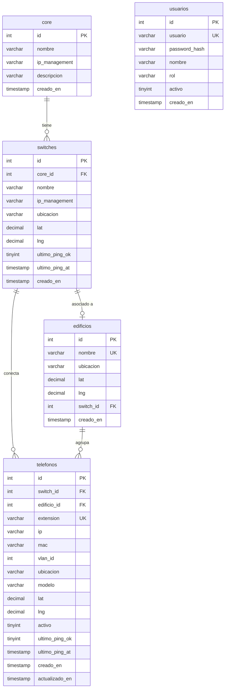

# Diagrama de Base de Datos - Sistema de Monitoreo de Red

## Descripción

Este diagrama representa la estructura de la base de datos `redes_tecnologico` para el sistema de monitoreo del Instituto Tecnológico de Oaxaca.

## Relaciones

- **core → switches**: 1:N — Un core tiene varios switches conectados.
- **switches → telefonos**: 1:N — Un switch conecta varios teléfonos IP.
- **edificios → telefonos**: 1:N — Un edificio agrupa varios teléfonos (para el mapa).
- **switches → edificios**: 1:1 opcional — Un edificio puede tener un switch asociado.

## Diagrama ER (Mermaid)

Para visualizar: copia el bloque siguiente en [Mermaid Live Editor](https://mermaid.live) o usa una extensión de Mermaid en VS Code.



## Diagrama de flujo de datos (topología)

```
                    ┌─────────┐
                    │  core   │
                    └────┬────┘
                         │
            ┌────────────┼────────────┐
            ▼            ▼            ▼
      ┌──────────┐ ┌──────────┐ ┌──────────┐
      │ switch 1  │ │ switch 2  │ │ switch N  │
      └────┬─────┘ └────┬─────┘ └────┬─────┘
           │            │            │
     ┌─────┴─────┐ ┌────┴────┐ ┌────┴────┐
     ▼           ▼ ▼         ▼ ▼         ▼
┌─────────┐ ┌─────────┐  ┌─────────┐
│teléfono │ │teléfono │  │teléfono │  ...
└─────────┘ └─────────┘  └─────────┘

     edificios (agrupan teléfonos por ubicación en el mapa)
```
